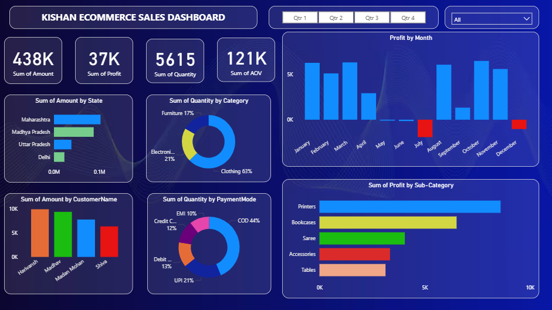

# 📊 Ecommerce Sales Dashboard | Power BI



## 📌 Project Overview

The **Ecommerce Sales Dashboard** is an interactive Business Intelligence project developed in **Power BI** to analyze online sales performance and generate actionable business insights.  

This dashboard enables users to monitor key KPIs such as sales revenue, profit, quantity sold, and average order value while exploring trends across customers, products, categories, states, payment methods, and monthly performance.

It demonstrates practical skills in **data analysis, dashboard design, data modeling, Power Query, and DAX**.

---

## 🎯 Business Objectives

- Track overall ecommerce business performance
- Monitor revenue, profit, and order quantity
- Identify top-performing states, customers, and categories
- Analyze monthly profit fluctuations
- Understand customer purchase behavior
- Evaluate preferred payment methods
- Support data-driven business decisions

---

## 📈 Key Performance Indicators (KPIs)

| Metric | Value |
|--------|-------|
| Total Sales Amount | 438K |
| Total Profit | 37K |
| Total Quantity Sold | 5615 |
| Average Order Value (AOV) | 121K |

---

## 📊 Dashboard Features

### ✅ Executive KPI Cards
Quick summary of total sales, profit, quantity sold, and AOV.

### ✅ Sales by State
Compare revenue contribution across different states.

### ✅ Monthly Profit Analysis
Track profit trends across all months to identify growth and loss periods.

### ✅ Quantity by Category
Analyze product demand across categories such as Clothing, Electronics, and Furniture.

### ✅ Profit by Sub-Category
Understand most profitable product segments.

### ✅ Customer Analysis
Identify highest contributing customers by sales amount.

### ✅ Payment Mode Analysis
Study customer preferences across COD, UPI, EMI, Debit Card, and Credit Card.

### ✅ Quarterly Filter
Dynamic slicer to analyze performance quarter-wise.

---

## 🛠️ Tools & Technologies Used

- **Power BI**
- **Power Query**
- **DAX**
- **Data Modeling**
- **CSV Data Sources**
- **Interactive Dashboard Design**

---

## 🗂️ Dataset Information

This project uses two datasets:

- `Orders.csv`
- `Details.csv`

These datasets contain ecommerce transactional records including:

- Orders
- Sales amount
- Profit
- Quantity
- Customer names
- Product categories
- States
- Payment methods

---

## 🔍 Key Insights Generated

- Maharashtra contributed the highest sales revenue.
- Clothing category had the highest quantity sold.
- COD was the most preferred payment mode.
- Printers and Bookcases were top profit-generating sub-categories.
- Certain months showed negative profit, indicating potential operational issues.
- A small group of customers contributed significantly to total sales.

---

## 📚 Skills Demonstrated

- Business Intelligence Reporting
- Data Cleaning & Transformation
- Dashboard Development
- KPI Tracking
- Data Storytelling
- DAX Calculations
- Trend Analysis
- Decision Support Analytics

---

## 📷 Dashboard Preview

> Add your dashboard screenshot here and rename it as `dashboard_preview.png`

---

## 📁 Project Files

```bash
📦 Ecommerce-Sales-Dashboard
 ┣ 📄 Orders.csv
 ┣ 📄 Details.csv
 ┣ 📄 final dashboard.pbix
 ┣ 📄 README.md
 ┗ 🖼️ dashboard_preview.png
